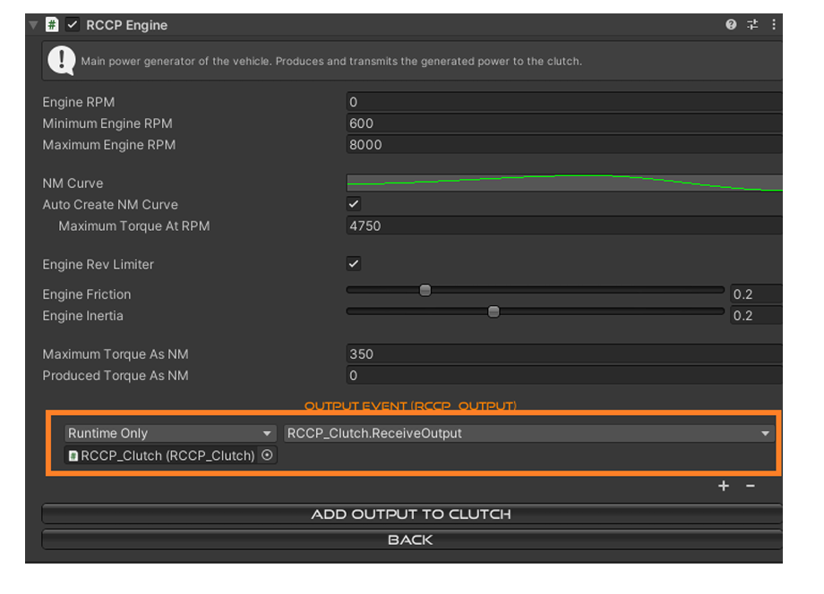
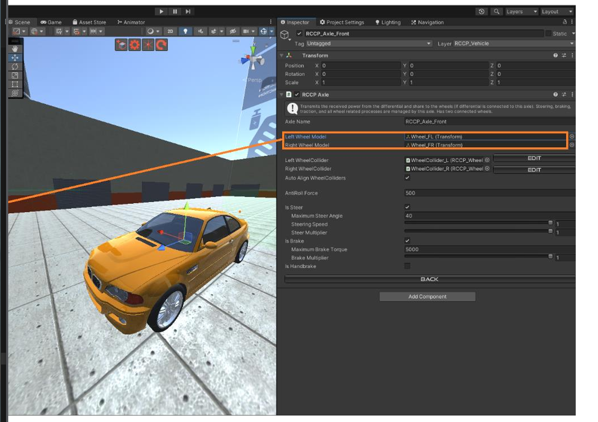
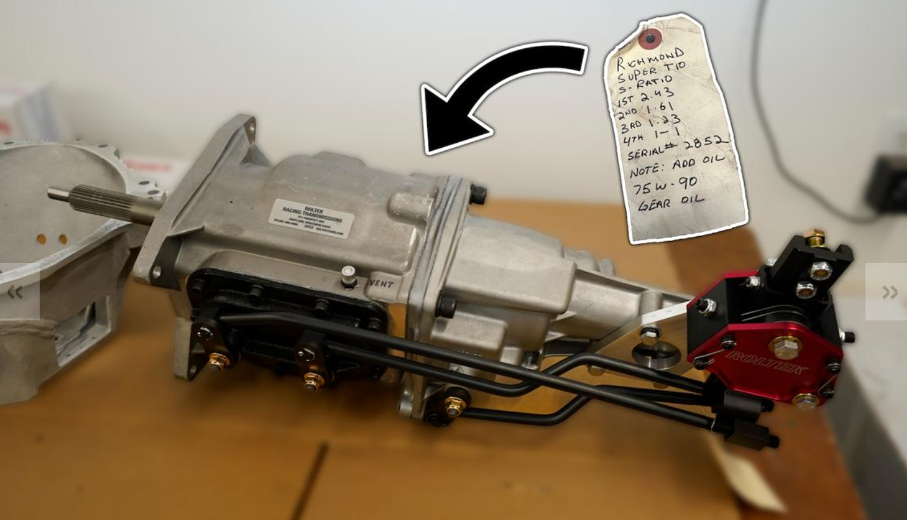

- car 1960,  Sound

### 引用

* https://www.youtube.com/watch?v=A_gKISKpEns
* https://www.youtube.com/watch?v=WueMYP_E2mk
* https://www.youtube.com/watch?v=-YTzqbOgdWU

### 笔记

- 通过这个事件注册来获得，通知

创建一个新车

- 点击“check”来检查是否是否有当前的组件

设置车轮

- 对车轮校准，手动，需要取消其Auto Align WheelColliders
- 确保车辆拥有collider，mesh collider

RCCP_Clutch

RCCP_Gearbox
将从发动机->离合器接收到的动力乘以 x 比率，然后传输到
差速器。较高的传动比 = 较快的加速度，较低的最高车速。较低的传动比 = 较慢的
加速，较高的最高车速。应该连接到轴上，但 RCCP 还没有将其

RCCP_Audio
管理属于车辆的所有音频源。发动机、变速箱、车轮、碰撞、排气以及
所有其他类型的音频。每个音源都可自定义音域、音量和音调。

RCCP_AI

车辆的人工智能控制器。有三种导航模式。跟踪航点、追逐目标和
跟踪目标。使用光标来避开路径上的障碍物。如果车辆发生碰撞或
无法前进，可进行倒车。脚本将计算与道路相关的油门、制动和转向，并
目标。然后，它会将这些输入输入到连接到车辆的 RCCP_Inputs 中。如果该组件连接到车辆上，所有
玩家的输入都将被忽略
