## Cinemachine

shift + ctrl + f ，移动摄像机

Follow 和 LookAt的区别

- 一个是跟随，一个是对着这个点保持不变

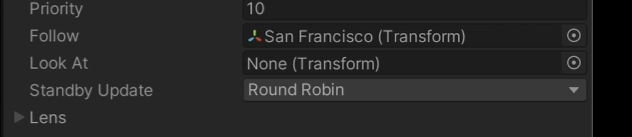

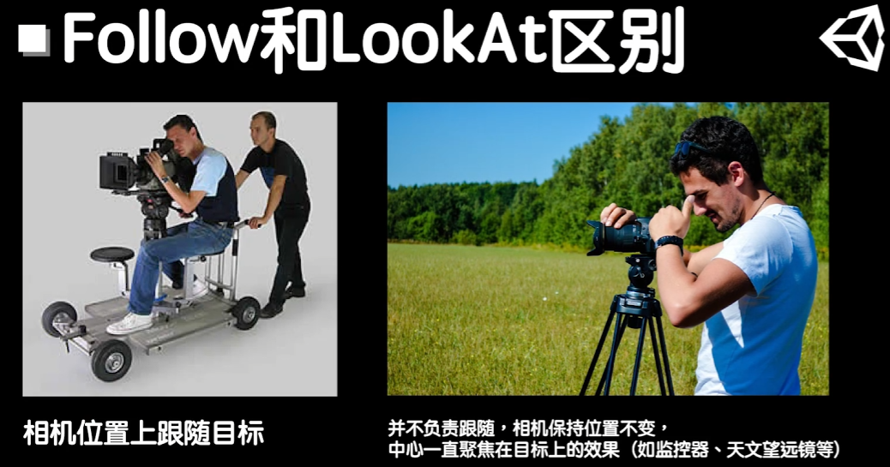

LookAt

- 即使物体旋转到后面，也还是会对准其目标点

  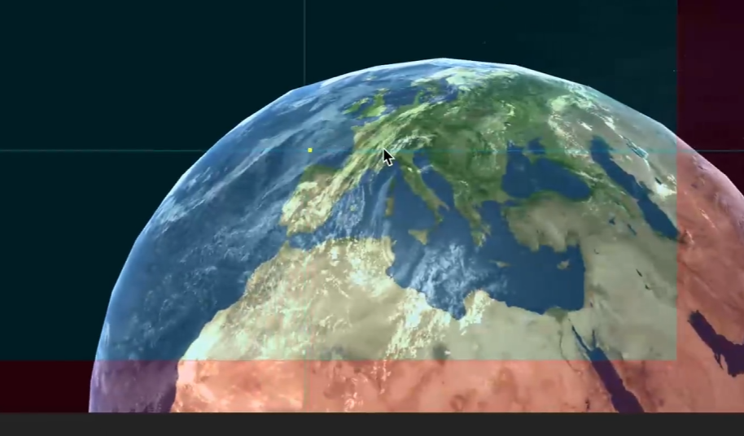

Noise

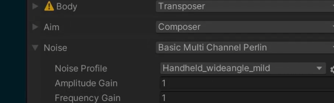

- 增加不同的抖动频率，比如在狙击枪，瞄准，增加一些抖动

Timeline

- 创建一个Timeline，并且会自动依托在Playerable

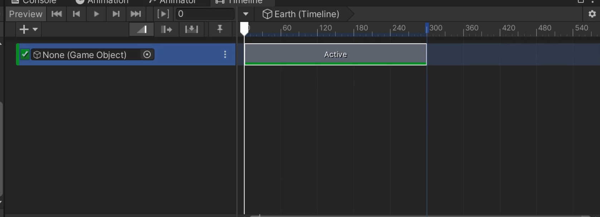

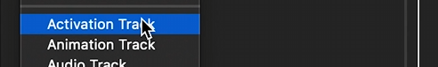

- Activation Tack，用于激活某个Game Object 在位置上的变化
- 在捡起东西的时候可以使用，比如手里的东西隐藏，然后显示捡起东西显示

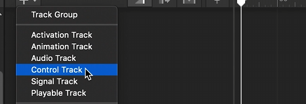

- 控制的轨道，控制不同的粒子效果等

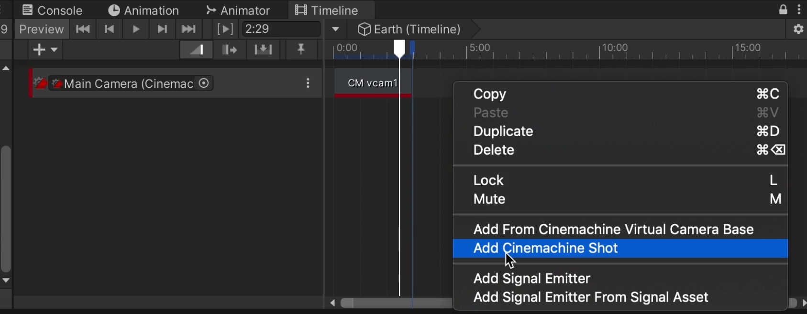

- Cinemachine Track, 用于控制Cinmachine Barin有关的镜头切换
- 可以通过增加 Shot一幕的方式，承载 virtual camera 来做到增加

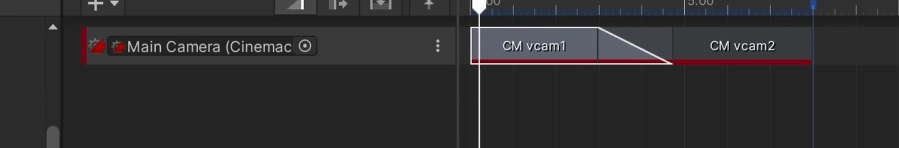

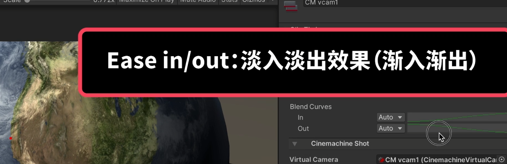

- 增加过渡，可以在此段时间内进行过渡；同时也可以通过修改Ease in/out 渐入检出，来修改其切换的形式

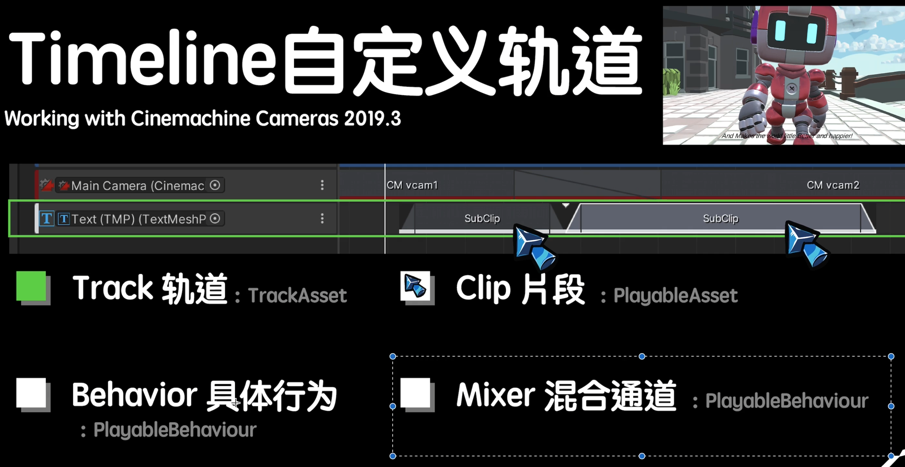

Audio Track

- 在track上增加Audio Sourece 以增加其声音的位置距离等部分内容
- 增加Audio pitch，以保证部分高的声调更高
- 增加Audio Low Pass Filter，可以模拟在水下或者，顿的声音

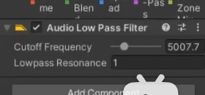

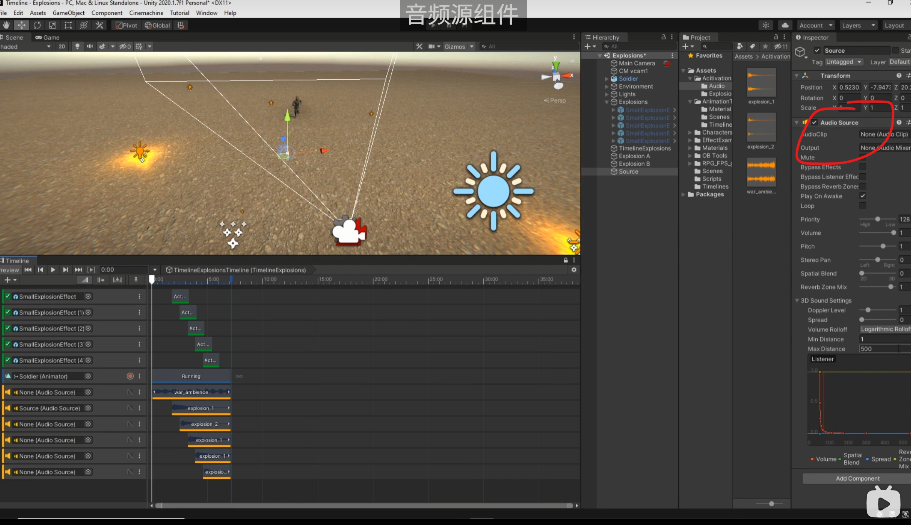

Signal Track

- 如在动画播放时，可以通过发送类似的Signal，以保证其控制是不可行的 =>结束播放在开启

## 例子

- Camera + Animation + 部分的Active组合，并增加摄像机的移动，以给出一些motion（可以看到某个点上加上了Animation的点）
- 同时如果出现动画不匹配的情况，增加offset即可

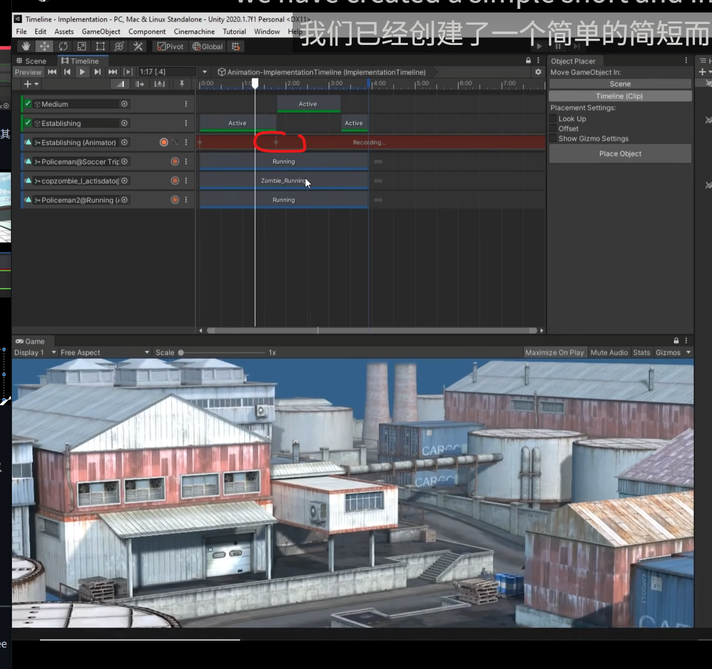

## 参考

* https://unity.com/cn/features/cinemachine

---

* https://www.bilibili.com/video/BV1oa4y1s7gg/?spm_id_from=333.1387.favlist.content.click&vd_source=b65b4c00f316d664c3c228425ee1743d
* https://www.bilibili.com/video/BV1dR4y147xS/?spm_id_from=333.337.search-card.all.click&vd_source=b65b4c00f316d664c3c228425ee1743d
