- https://docs.michsky.com/docs/dark-ui/quick-start/

## 整理

== 快速使用

- 使用Input System (New)
- 需要关注不同平台的输入问题，估涉及的平台为inputSystem

== UIManager

- 位置

  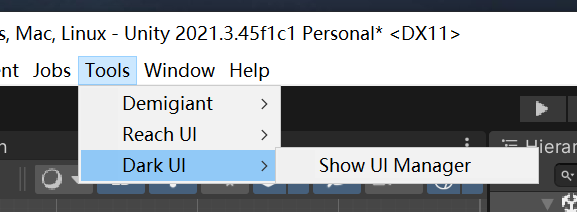
- “换皮”控制器

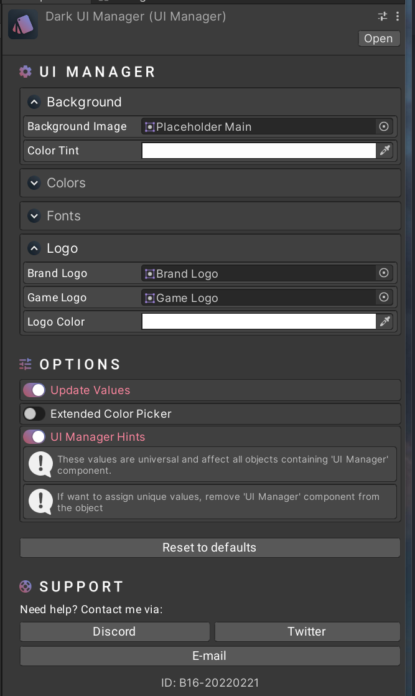

- Update Values

  - hui动态更新UI elements，相反则会在play之后（runtime）更新

  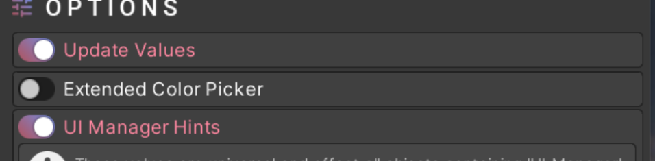
- 脚本解释

  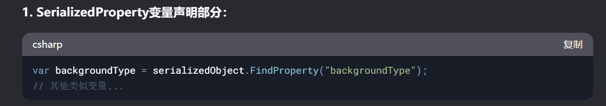

  - 应该是访问Editor通过 `serializedObject`访问被编辑对象的序列化数据
  - 使得编辑器能够可视化修改脚本的对应字段
  - 以及更换自定义的GUISKin
- 可以看更加详细的颜色hex

  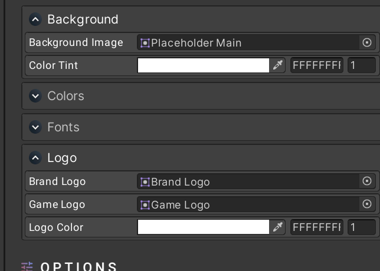
- UI Manager Hints ： 查看每个manger的tips

== UI Elements

Button

- 设置text
- 通过UpdateUI来更新，并forcelayoutgroup的修改

```csharp
using Michsky.UI.Dark; // namespacepublic ButtonManager myButton; // Your button variablevoid YourFunction()
{
   // Updating button content
   myButton.buttonText = "My New Text";
   myButton.UpdateUI();   // Enable or disable options
   myButton.useRipple = true;
   myButton.useCustomContent = false;
}

```

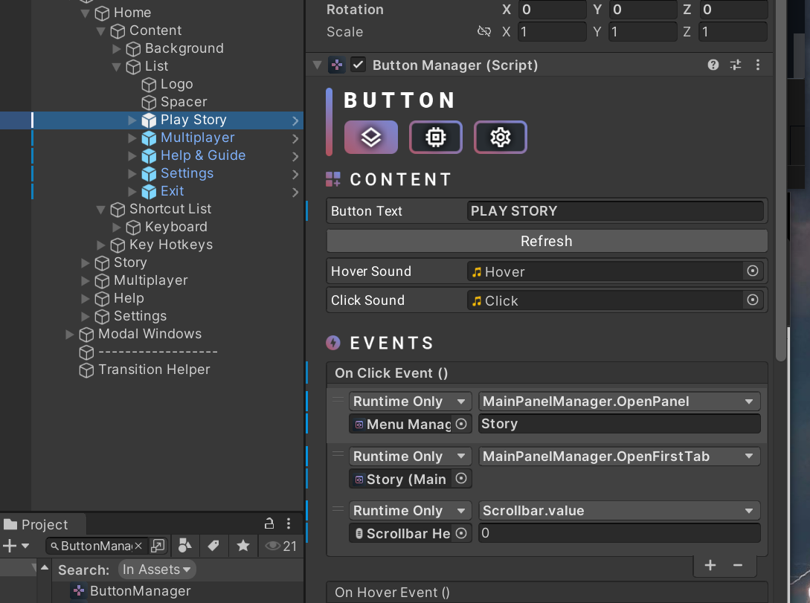

Horizontal Selector

- 似乎是list中向前或者向后的内容
- Items,  您可以在此列表中添加水平选择器项目。如果愿意，还可以为每个项目添加功能。只要启用 “指示器”，每个按钮都会在运行时生成一个指示器项。
- Saving，启用此功能后，您可以保存所选值。请注意，每个选择器都应有自己唯一的选择器标签值。否则，选择器之间可能会发生冲突。

```csharp
using Michsky.UI.Dark; // namespacepublic HorizontalSelector mySelector; // Your selector variablevoid YourFunction()
{
   // Creating a new item
   mySelector.CreateNewItem("Item Title");   // Creating items within a loop
   for (int i = 0; i < yourIndexOrVariable; ++i)
   {
	  mySelector.CreateNewItem("Item Title");
   }   // Adding a new dynamic event
   mySelector.selectorEvent.AddListener(YourEventHere);   // Initializing the selector - use this if you've created a new item at runtime
   mySelector.defaultIndex = 3; // optional
   mySelector.SetupSelector();   // Changing index & updating UI
   mySelector.index = 3;
   mySelector.UpdateUI();   mySelector.ForwardClick(); // Select next item
   mySelector.PreviousClick(); // Select previous item
   mySelector.RemoveItem("Item Title"); // Delete a specific item
}

```

Modal Window

- 用于定义一个弹窗的内容，使用 Modal Window manger
- 提供了接口，统一更新ui，以及fade In ， fade out
- 对Bulrmanger的使用，可以帮助其显示的时候有虚化的作用

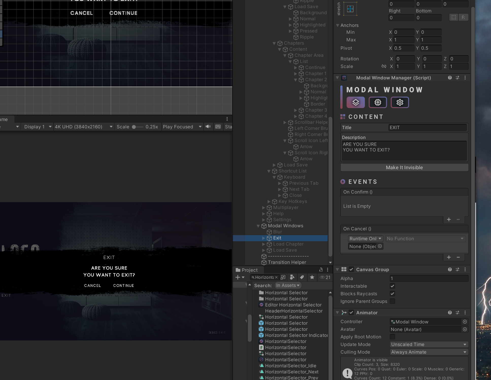

Slider

- 基本使用的是原生的slider组件
- 在此基础上加上了定制的内容

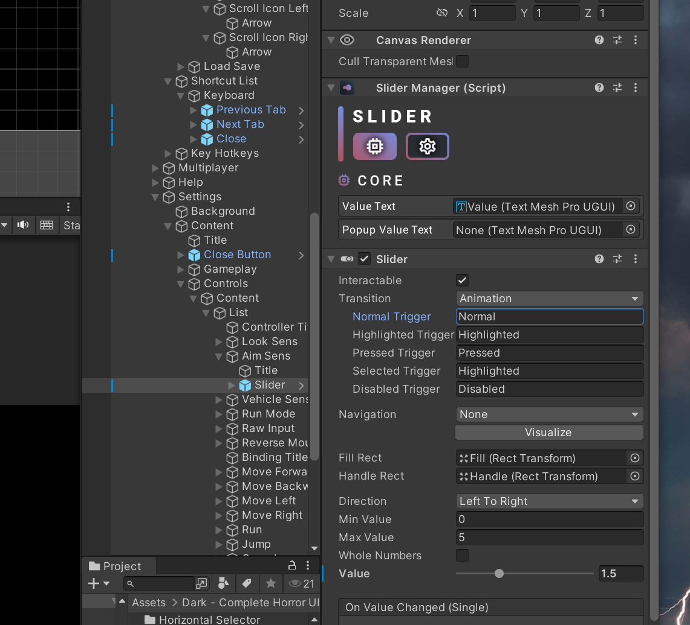

==  Panels & Windows


==  Splash Screen

- Splash Screen Manager， 基本就是用来延迟显示一些内容的页面
- 注意代码的使用方式

```csharp
usingMichsky.UI.Dark;//namespace

publicSplashScreenManagerssManager;

voidYourFunction()
{
ssManager.disableSplashScreen=false;//Disableorenablesplashscreen
ssManager.startDelay=0.5f;//Addadelaybeforethesequence
}

```

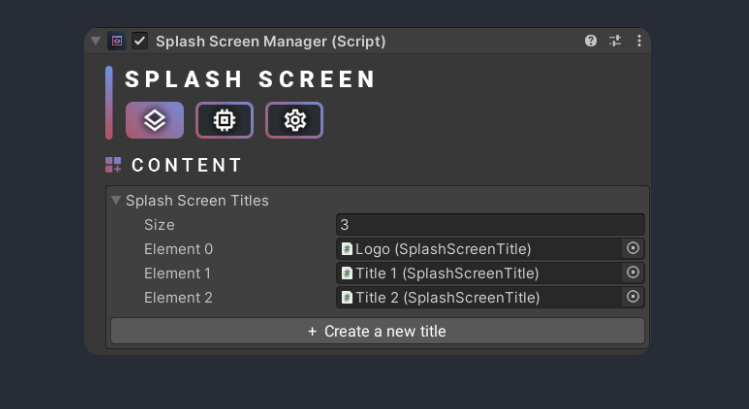

 == Gamepad Handler

- 应该是用于控制输入设备的识别
- 默认面板管理器： 管理用户界面的主要组件。它默认连接到 “菜单管理器”。
  面板管理器 场景中的所有主面板管理器。
  键盘对象： 这些对象将在鼠标/键盘的任何意义上激活，并在游戏手柄的意义上停用。
  游戏板对象： 这些对象将在任何意义上的游戏板上激活，并在鼠标上停用。
  始终更新：断开/连接时将更新输入设备。
  影响光标： 根据游戏手柄状态启用或禁用光标。
  游戏手柄热键： 这些输入会影响游戏手柄状态的切换。
- 关注代码的使用方式
  - 判断是否有接入
  - 判断更新的频次等

```csharp
using Michsky.UI.Dark; // namespace
public GamepadChecker gamepadManager;void YourFunction()
{
   gamepadManager.alwaysUpdate = true; // Change the update state
   gamepadManager.gamepadConnected; // Get the gamepad conenction state
   gamepadManager.hAxis; // Get the right stick horizontal axis (0f - 1f)
   gamepadManager.vAxis; // Get the right stick vertical axis (0f - 1f)
}
```

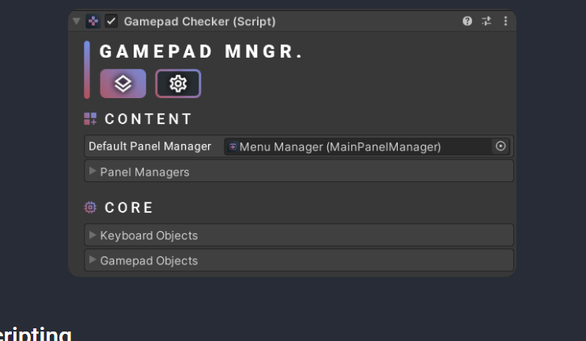

==  Gamepad Scroll Event

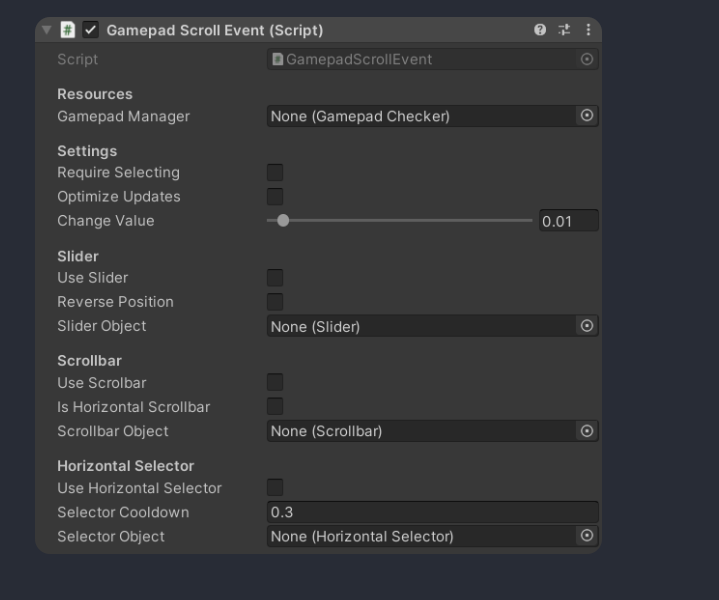

== Localization

- 本地化
- 通过其他的ui组件来完成内容
