## reference

- https://www.youtube.com/watch?v=KyNzIb-chxs
- https://www.youtube.com/watch?v=xGpNA5UGsTs&t=147s
- https://www.youtube.com/watch?v=xTCwk3hRUYw
- https://www.youtube.com/watch?v=cYBBqboHzDQ
- （character）: https://docs.gamecreator.io/gamecreator/characters/component/
- （Animation）https://docs.gamecreator.io/gamecreator/characters/animation/
- （States）https://docs.gamecreator.io/gamecreator/characters/animation/states/

## Game Creator

Main Features

| col1                         | col2                                                                                                                                     | col3                                        |
| ---------------------------- | ---------------------------------------------------------------------------------------------------------------------------------------- | ------------------------------------------- |
| **Player Input**       | 玩家的输入，控制方式                                                                                                                     |                                             |
| **Rotation Modes**     | 旋转的方式，摄像头的方向，移动方向                                                                                                       |                                             |
| **World Navigation**   | 角色如何在场景中移动， - Character Controller, a Navigation Mesh Agent,  or plug-in a custom controller. - 以上都可以使用 |                                             |
| **Gestures & States**  | - 建立在Unity的mEcanim之上 简化播放动画的方式                                                                                       |                                             |
| **Inverse Kinematics** | - 可扩展的IK系统 - 较为逼真的身体定位和橘色脚对其                                                                                   |                                             |
| **Footstep Sounds**    | - 脚步系统，可根据多层的材料和纹理，混合不同的声音                                                                                       |                                             |
| **Dynamic Ragdoll**    | - 可以让角色切换到无缝切换到布偶状态（或者从布偶状态切换）                                                                               |                                             |
| Is Player                    | - 决定是否处理，“玩家”输入 - 场景中只有一个 - 默认是                                                                         | 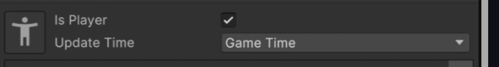 |

### Characters

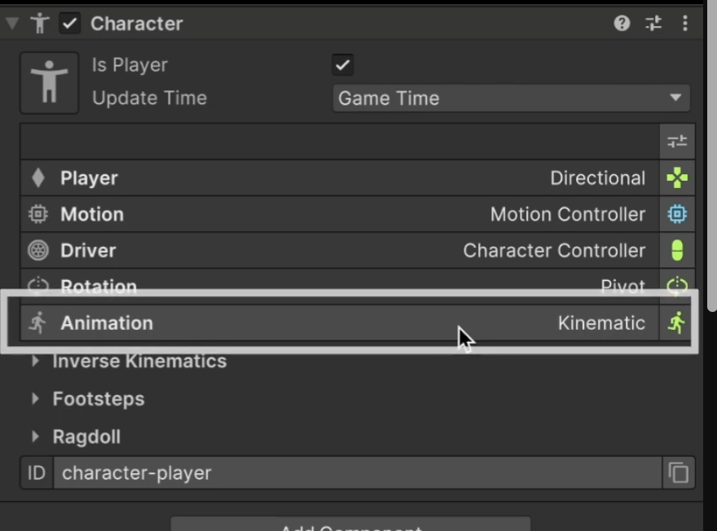

| col1                  | col2                                                                                                                                                                                                                                                                                                                                                                                                                                                                                                   | col3                                        |
| --------------------- | ------------------------------------------------------------------------------------------------------------------------------------------------------------------------------------------------------------------------------------------------------------------------------------------------------------------------------------------------------------------------------------------------------------------------------------------------------------------------------------------------------ | ------------------------------------------- |
|                       | - Is Player: 是否可控制角色 - Update Time： 是由内部时间决定，还是real-life Clock决定 - “右侧小绿人”，为一个调试工具 运行时为“绿色” - 当诸如“跳跃”，或者忙时，执行阻挡动作，他会变为红色 - 角色死亡时，人体图标设置为“红色骷髅头”                                                                                                                                                                                                                                     | 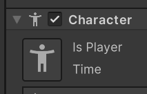 |
|                       |                                                                                                                                                                                                                                                                                                                                                                                                                                                                                                        | 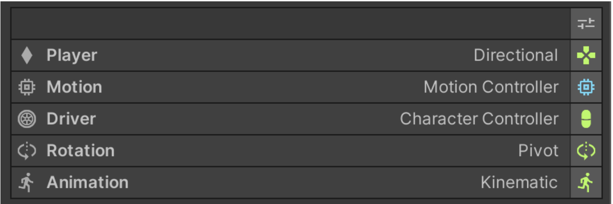 |
| Player                | **Directional：角色相对于主摄像头的方向移动，对wasd，和左摇杆做出反应 **Point & Click**：点击朝着固定的位置移动 **Tank**：**                                                                                                                                                                                                                                                                                                                                               | 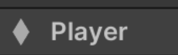 |
| Motion                | - Motion拥有Interaction的部分，用于和场景中特定Element交互                                                                                                                                                                                                                                                                                                                                                                                                                                             | 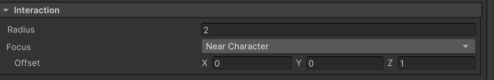 |
| Driver                | Driver将motion data转换实际的Movment，基于以下三种不同的驱动方式 - **Character Controller** - **Navmesh Agent** - **Rigidbody**                                                                                                                                                                                                                                                                                                                                    |                                             |
| Rotation              |                                                                                                                                                                                                                                                                                                                                                                                                                                                                                                        |                                             |
| Animation             | 控制角色动作的移动                                                                                                                                                                                                                                                                                                                                                                                                                                                                                     |                                             |
| Extra Setting         |                                                                                                                                                                                                                                                                                                                                                                                                                                                                                                        |                                             |
|                       |                                                                                                                                                                                                                                                                                                                                                                                                                                                                                                        |                                             |
| Inverse Kinematics    |                                                                                                                                                                                                                                                                                                                                                                                                                                                                                                        |                                             |
| **Position**    | 决定角色组件内人体模型的局部位置。旋转和缩放也会改变人体模型在本地空间的变换。                                                                                                                                                                                                                                                                                                                                                                                                                         |                                             |
| **Smooth Time** | 角色之间动画的转换时间，单位为秒数。数值越大，过渡越平滑，时间越长，反应越慢。 数值越小，越接近0，角色反应速度越快，越灵敏                                                                                                                                                                                                                                                                                                                                                                        |                                             |
| **Mannequin**   | 根 “角色 ”和 3D 模型之间的中间游戏对象。                                                                                                                                                                                                                                                                                                                                                                                                                                                             |                                             |
| **Animator**    | The Animator component of the character's 3D or 2D model.                                                                                                                                                                                                                                                                                                                                                                                                                                              |                                             |
|                       |                                                                                                                                                                                                                                                                                                                                                                                                                                                                                                        |                                             |
|                       |                                                                                                                                                                                                                                                                                                                                                                                                                                                                                                        |                                             |
|                       |                                                                                                                                                                                                                                                                                                                                                                                                                                                                                                        |                                             |
|                       |                                                                                                                                                                                                                                                                                                                                                                                                                                                                                                        |                                             |
| Extra Settings        |                                                                                                                                                                                                                                                                                                                                                                                                                                                                                                        |                                             |
| Inverse Kinematics    | IK，允许角色改变骨骼旋转，改变整理尖端到目标位置的旋转。 常见的一个应用是保持角色脚步正确对转陡峭的地形。 - 添加或移除新的IK系统，只需点击“添加IK RIG Layer” - 可以自己定制IK系统，，[Custom IK](https://docs.gamecreator.io/gamecreator/characters/scripting/ik/) 较为常见的IK系统 - Look at Taeget ： 轻微旋转头部，颈部的，胸部的骨骼点，可以于Hotspots组件一同使用 - **Align Feet with Ground:** 可以自动检测角色何时接触地面，并根据地面的倾斜度来调整其双脚 | 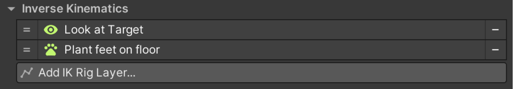 |
| Footstep              | 脚下的脚印，播放模拟粒子效果，播放的声音效果 - 通过添加脚来增加对应的效果 - 脚步声不会播放原始的声音，会更具不同的纹理来修改音调，使得不太突出的纹理变弱 - **Sound Asset**： Footstepsound来增加脚步的声音，但是具体还是要调整[Footstep Sounds](https://docs.gamecreator.io/gamecreator/characters/footstep-sounds/)                                                                                                                                                                | 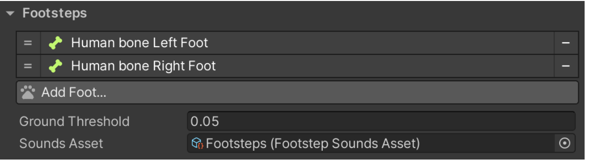 |
| Ragdoll               | 布娃娃系统 - 决定哪些部分与哪骨骼相对应                                                                                                                                                                                                                                                                                                                                                                                                                                                           |                                             |

### Animation

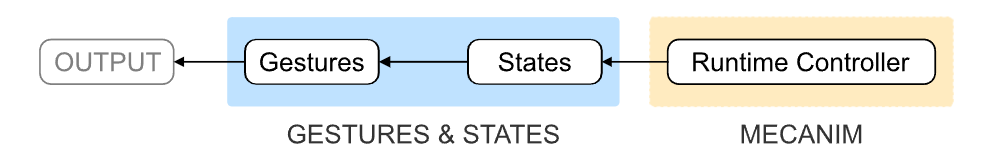

- 两种不同的播放的概念， Gesture，States
- Mecanim：为人物的动画系统

| col1                        | col2                                                                                                                                                                                                                                                                                                                                                                                                                                                                                                                                                                                                                                                                                                                                                                                 | col3                                                                                                                                          |
| --------------------------- | ------------------------------------------------------------------------------------------------------------------------------------------------------------------------------------------------------------------------------------------------------------------------------------------------------------------------------------------------------------------------------------------------------------------------------------------------------------------------------------------------------------------------------------------------------------------------------------------------------------------------------------------------------------------------------------------------------------------------------------------------------------------------------------ | --------------------------------------------------------------------------------------------------------------------------------------------- |
| Gesture                     |  - 例如，一个挥拳的动作，作为手势播放，并在动画结束后，恢复之前的动画 - 这些动作在其他动作之上播放 - 最重要对的参数为Character 和Animation Clip ，其余的为Default，并且可在大部分的情况下运行  参数 - Character：动画剪辑将播放的对象，引用的对象需要**包含Character组件** - Animation Clip，引用对应的动作片段 - Animation Mask， 对应动作的遮罩 - Blend Mode ： 决定了动画是**覆盖**正在播放的其他动作，还是**叠加**在在其他动作上； Blend：覆盖所有动画，在其上播放Clip，大多数 Additive：混合此动作在其他之上 - speed：越大播放的速度越快 - Root Motion ：  - Transition ： Transition in，转换in需要的时间，以及Transi out的时间 - Wait to Complete:"等待完成"仅在动画完成后执行 | 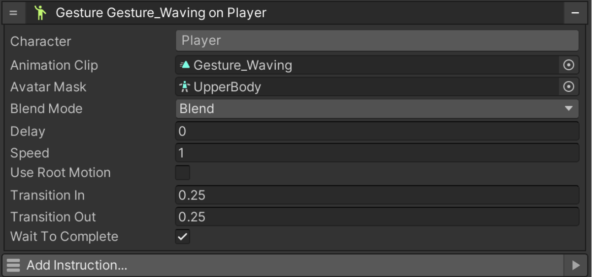 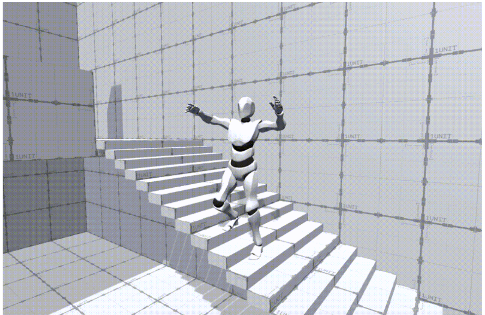 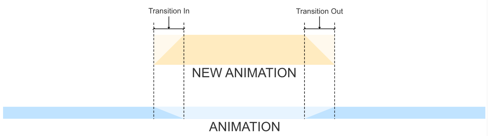 |
| **States**            | - 角色处于一个repeating loop之间 - 如角色坐在一个椅子上，是一个Animation State， - 如果角色蹲下则为一个Locomotion State - 在下方更详细的解释                                                                                                                                                                                                                                                                                                                                                                                                                                                                                                                                                                                                                          |                                                                                                                                               |
| **Animation States**  | - 播放一个animation clip，重复，直到叫它停止                                                                                                                                                                                                                                                                                                                                                                                                                                                                                                                                                                                                                                                                                                                                         |                                                                                                                                               |
| **Locomotion States** | -  通过默写数值，如角色的Speed，并拥有不同的Clip来 transition 和blending                                                                                                                                                                                                                                                                                                                                                                                                                                                                                                                                                                                                                                                                                                            |                                                                                                                                               |

- 这些动作在其他动作之前播放

#### States

- 有两种States

| col1                    | col2                                                                                                                                                                                                                                                                                                                             | col3                                                                                         |  |
| ----------------------- | -------------------------------------------------------------------------------------------------------------------------------------------------------------------------------------------------------------------------------------------------------------------------------------------------------------------------------- | -------------------------------------------------------------------------------------------- | - |
| Animation States        | - state Clip， State Mask - Entry and Exit：在进入字段和退出字段 比如拔剑进入战斗状态，收剑，退出战斗姿态                                                                                                                                                                                                              | 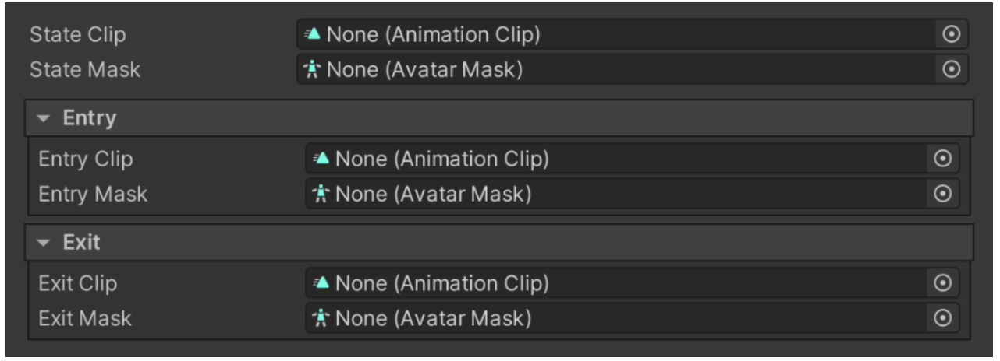                                                  |  |
|                         | - 从**2.9.34开始，State包含了不同的属性部分**- 并可以通过修改Common Valuse来修改部分内容  -比如不同的速度，重量，等内容                                                                                                                                                                                              | 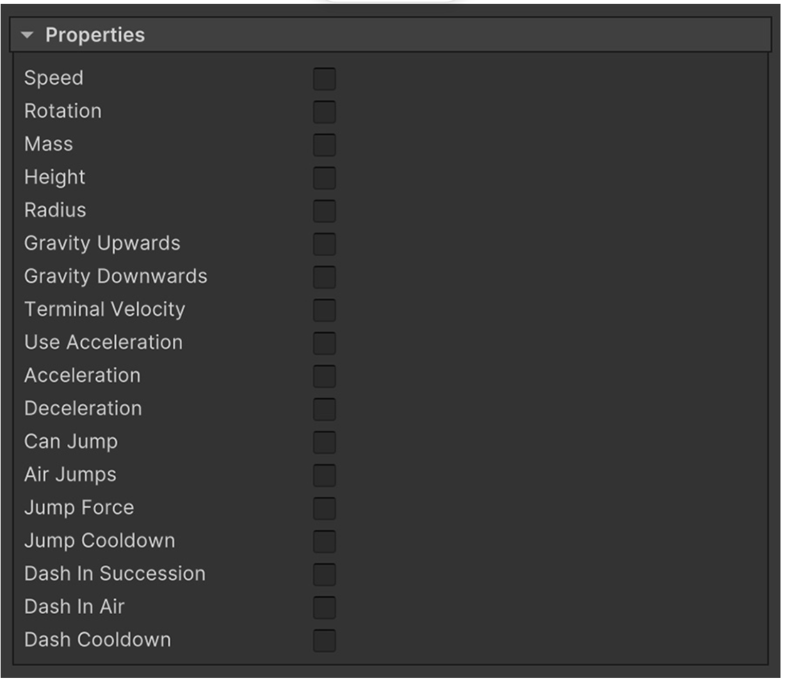                                                  |  |
| Changing Movement Speed | Running State 在Layer 1， 设置speed 为10 Walking State 在Layer 2， 设置为 Speed 为5 - Running State 将会首先Call， 然后是 walking Stae，                                                                                                                                                                               |                                                                                              |  |
|                         |                                                                                                                                                                                                                                                                                                                                  |                                                                                              |  |
|                         |                                                                                                                                                                                                                                                                                                                                  |                                                                                              |  |
|                         |                                                                                                                                                                                                                                                                                                                                  |                                                                                              |  |
| Locomotion States       | - 使用与更加复杂的，面对部分参数做出反应 ；角色的速度、方向、坠落速度 - 运动状态、过渡、混合剪辑 参数 Basic States， Complete States：一个空闲状态 + 8轴方向动画剪辑； 一个空闲状态 + 用于移动16个方向 （8半速，8用于全速） - 如果需要使用摇杆来推动，以呈现跑步和行走的动画，可以考虑使用16points | 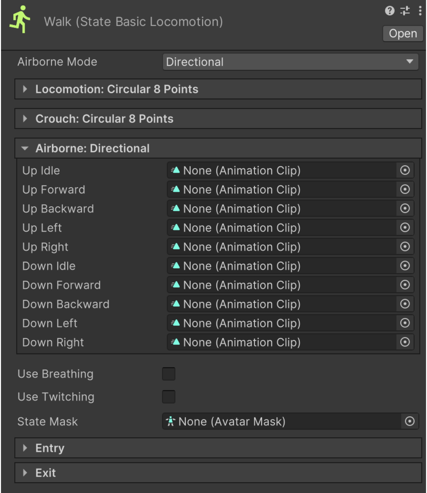                                                  |  |
| **Airborne Mode** |                                                                                                                                                                                                                                                                                                                                  | 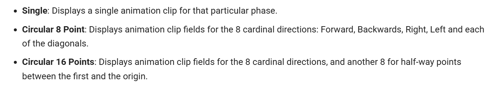                                                  |  |
| Layers                  | - 使用Layer的想法来创建这个State的concept - 任何state，被分配了layer number，更高的number， 占有更加高的优先权，当播放动画的时候 - 推荐使用Transition time，使其过渡更加顺滑                                                                                                                                      | 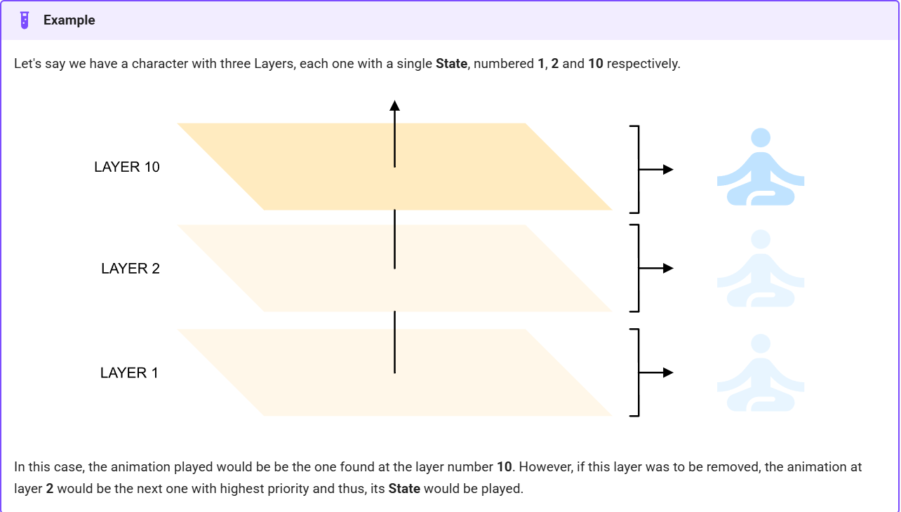 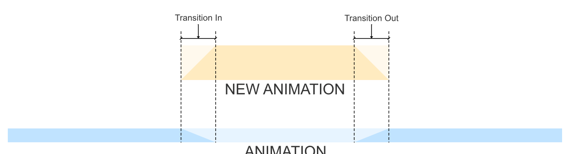 |  |
| Weight                  |                                                                                                                                                                                                                                                                                                                                  |                                                                                              |  |
|                         |                                                                                                                                                                                                                                                                                                                                  |                                                                                              |  |
|                         |                                                                                                                                                                                                                                                                                                                                  |                                                                                              |  |

### Inverse Kinematics

- Manage IK Rigs：管理哪些装备可以影响角色的属性
- IK绑定，从上到下的顺序执行，如果两个IK影响同一条骨骼链，最后一个绑定将覆盖所有之前的绑定

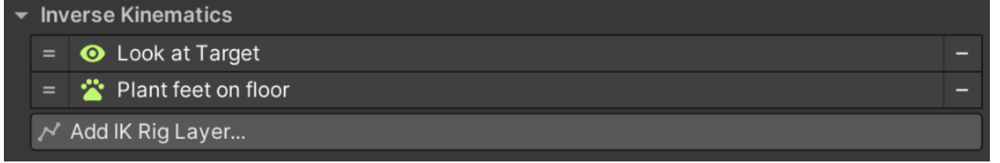

Feet Align Rig

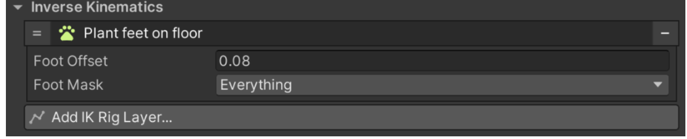

- Foot Mask: 用于角色与地面之间对其应考虑的图层，如水通常具有碰撞器组件，

### Camera

- Main Camera, Camera Shots
- Fixed Camera , Follow Target, Third Peson

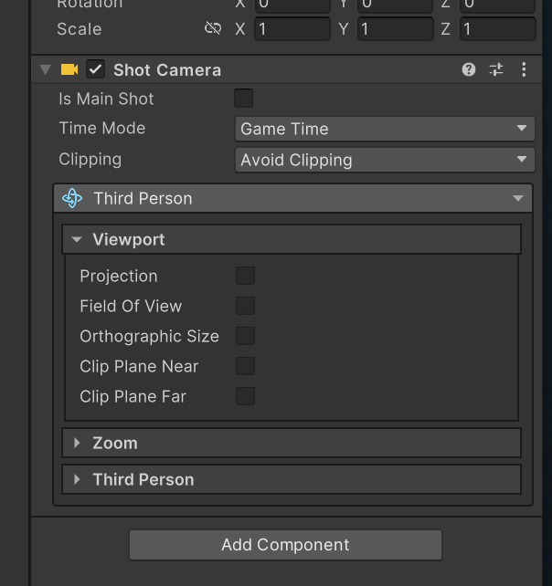

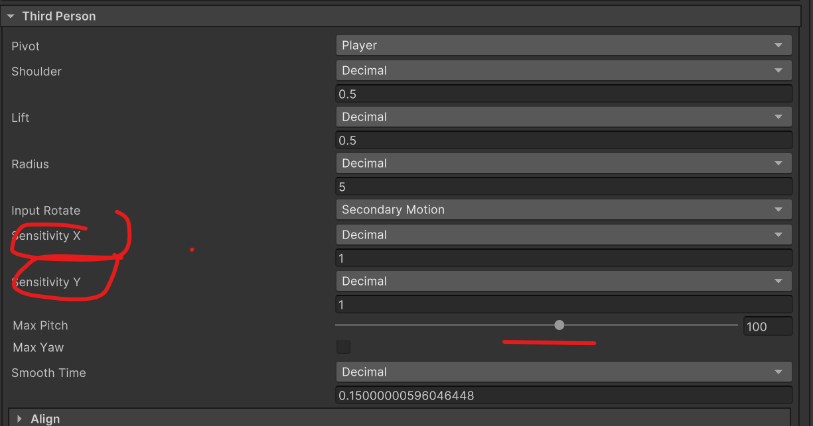

Camera的灵敏度：调整为1
