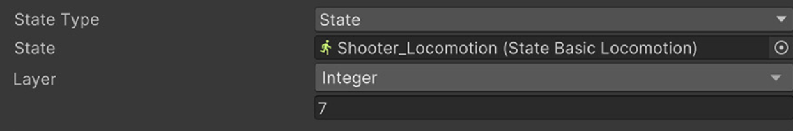
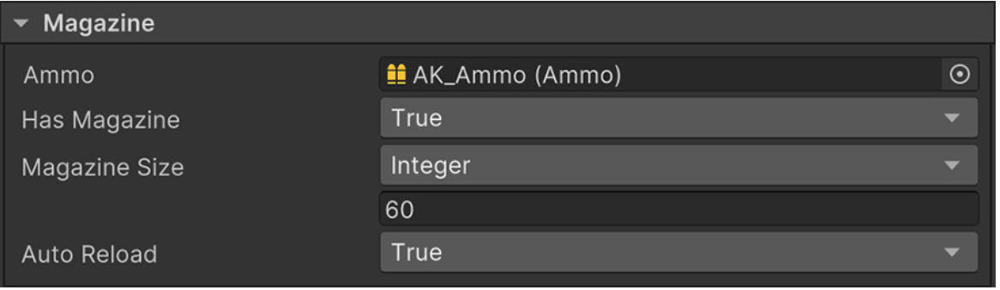
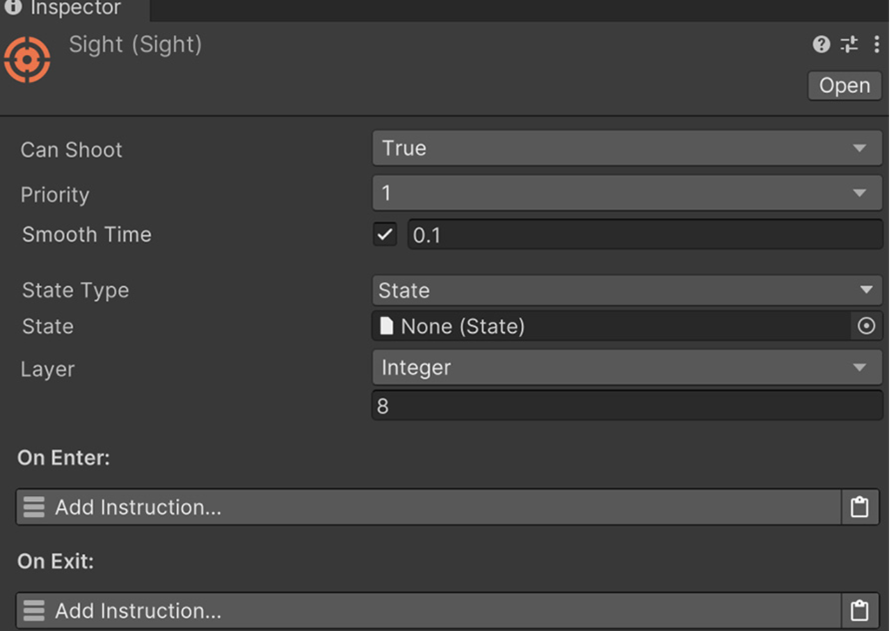
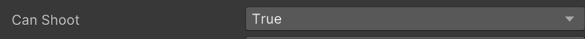
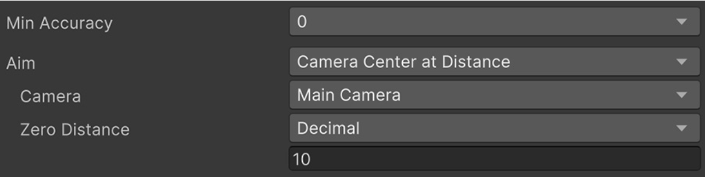
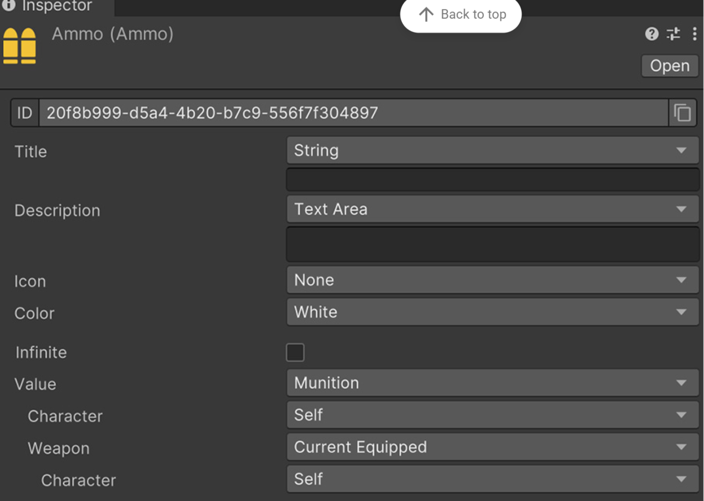

## Shooter

weapon Data

title, Description, Icon, Color....

| col1                           | col2                                                                                         | col3                                        |
| ------------------------------ | -------------------------------------------------------------------------------------------- | ------------------------------------------- |
| Hit Reaction                   | 应该是此武器，角色被击中时特定的反应                                                         |                                             |
| ID                             | 唯一，防止同时穿上同一件装备                                                                 |                                             |
| Weapon State                   | On Enter Gesture, 持有武器后进入装备模式                                                     |  |
| **Layer**                | Layer表示哪一层Layer将会                                                                     |                                             |
|                                |                                                                                              |                                             |
| Weapon Mode                    | 用于配置装备，可以进入一个装备模型界面在场景中                                               |                                             |
|                                |                                                                                              |                                             |
| Changing the 3D model          | 默认为水枪模型，通过更改模型，来更改为需要使用的模型                                         |                                             |
|                                |                                                                                              |                                             |
|                                |                                                                                              |                                             |
|                                |                                                                                              |                                             |
| Magazine                       | 用于配置装备可使用的弹药类型                                                                 |                                             |
|                                |                                                   |                                             |
| Ammo                           | 必须引用Ammo的字段                                                                           |                                             |
| **Has Magazine**         | 应该是否是固定弹夹的大小                                                                     |                                             |
| Magazine Size                  | 弹夹的子弹数量                                                                               |                                             |
| Auto Reload                    | 没有弹药时，重新装填                                                                         |                                             |
| Muzzle                         | 子弹的位置                                                                                   |                                             |
| FIre                           |                                                                                              |                                             |
|                                |                                                                                              |                                             |
| **Projectiles per Shot** | 每次射击弹丸的数量（霰弹枪，每次弹丸会大于1个， 或者是另一种射击模式，每发使用4个弹夹） |                                             |
| Mode                           | 模式是一个下拉字段，用于选择扣动和松开扳机时武器的行为方式。                                 |                                             |
| **Fire Animation**       | 角色在射击时的动作                                                                           |                                             |

### Sights

- 用于决定武器的瞄准模式，

| col1                  | col2                                                                                                                                        | col3                                        |
| --------------------- | ------------------------------------------------------------------------------------------------------------------------------------------- | ------------------------------------------- |
| **Can Shoot**   | - 使用的这个Sight是可射击的还是如何； - 如果是类似拔出武器的，非射击，设置为False即可 - 可以设计一个Cover保护机制，可以瞄准并射击 |  |
| Priority              | - 装备的先后，                                                                                                                              |                                             |
| **Smooth Time** | - 平滑事件，决定瞄准的滞后程度 - 禁用，不会有任何延迟，角色会立刻瞄准                                                                  |                                             |
| State                 | - State字段允许，允许进入Animation State，当切换Sight的时候 - use Avatar Mask - Mix Weapon states and Sight states                |                                             |
| On Enter， On Exit    | - 在切换为Sight时候的回调 - 在使用肩上摄像头缩小视野范围时，进入时应缩小视野，退出时则恢复默认值。                                     |                                             |

### Aiming

- 当角色Aim时使用SIght

| col1 | col2 | col3 |
| ---- | ---- | ---- |
|      |      |      |
|      |      |      |

### Ammo

- 标题，描述，图标，字段，等常用值，只在界面中表示信息，对游戏无影响
- infinite，默认状态下，该值代表武器的弹药总量
-
