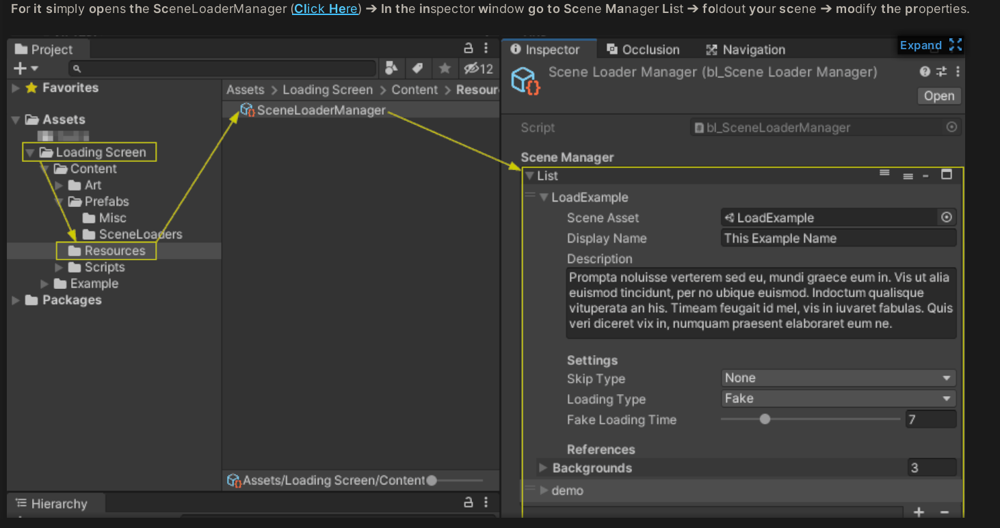
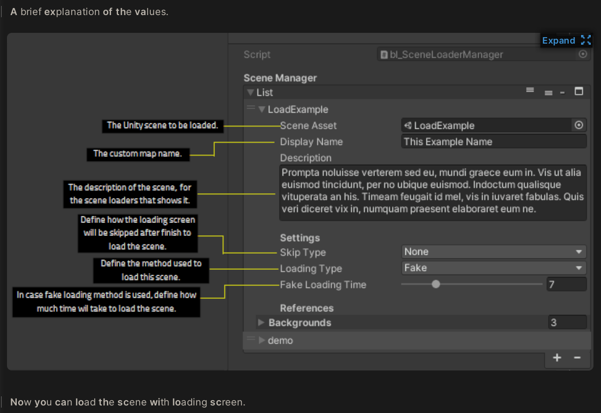
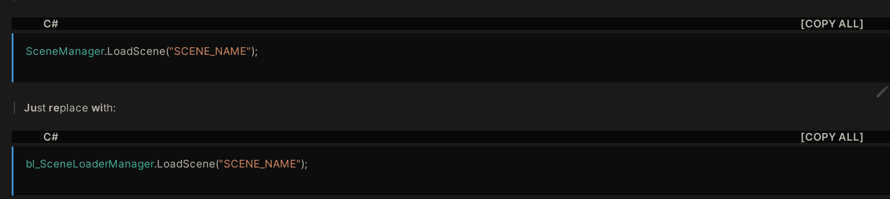

## Doucument

- 进入bl_SceneLoaderManager ， 添加对应Scene和Tips
- 每一个loader都是一个ui，直接放在Canvas中通过触发loadLevel（）来完成跳转

== 

如何载入一个场景

- 需要在eneLoaderManager，中添加对应的信息
- 包括 tips，图片，场景信息

- 可能只是包含如何跳转的信息
  - 需要载入的场景|| 定义的map名字 || 对于场景的描述 || 定义将以何种方式跳过或者结束载入的场景 ，会有按键或者啥|| 定义用来载入场景的方法|| 定义将使用多久来载入场景

== 

代码如何调用

- 替换原有的SceneManger的载入方式， 使用新的bl_SceneLoadManger.LoadScene("...")

- 不同的mode使用同一个loader唯一

== 

不同的进度条显示显示方式

- 正常的异步载入
- Fake，限定秒数，然后在这些时间内显示完
- 关键点在于，场景的模型越多，显示的质量越高，时间越长
