# Reference

- https://odininspector.com/tutorials/odin-validator/creating-custom-fixes

- https://www.youtube.com/watch?v=OvEBsoWbW6M&list=PL_HIoK0xBTK6MTuh7-wDjzccINYG_IMFC&index=6


# Validate Using Attributes

- 最常见的使用方法，为类和类成员添加属性
- 目前支持的以下内置属性

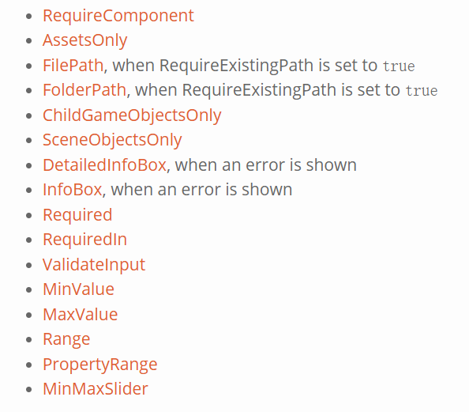

```csharp
public class test : MonoBehaviour
{
    [Required]
    public string Name;

    [MinValue(0), MaxValue(100)]
    public int Health;

    [ChildGameObjectsOnly]
    public GameObject Child;
}
```

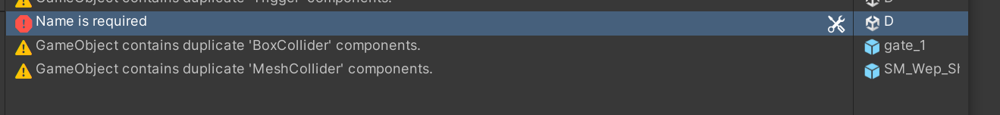

## ValueValidator

- 可以验证value得得情况

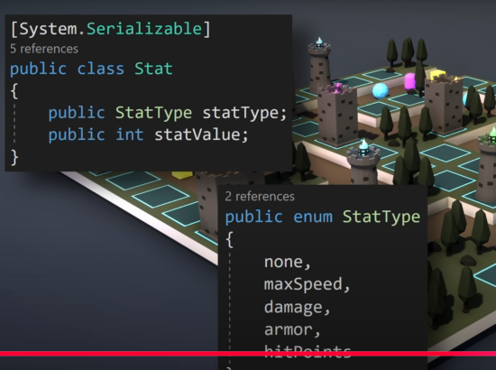

- 通过验证其type来获取对应的内容

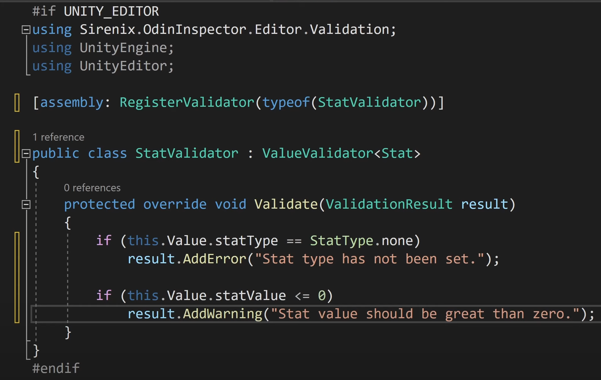

- 可以通过各式各样得防止来添加部分内容

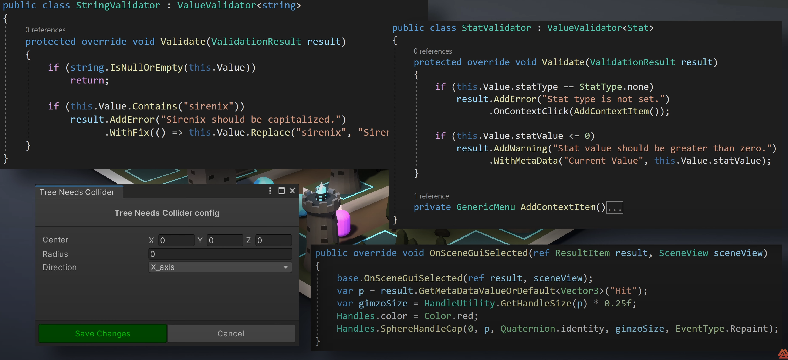

## RootObjectValidator

- 非常适用于验证scriptableObjects, Materials and Components
- 只会获得某些警告和提示

何时使用这些

- 试图验证项目中某一特定类型的出现，并且它为root object
- 统一通过一个地方来验证，而不是在每一处都添加
- 如果需要验证一个component

创建自定义 RootObjectValidator

- `Odin Validator > Create Validator > Root Object Validator`.
- 通过assembly来注册此内容，或者可以通过RegisterValidationRule来完成验证
- [Validators vs Validation Rules](https://odininspector.com/tutorials/odin-validator/validators-vs-validation-rules)

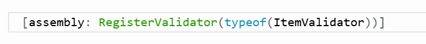

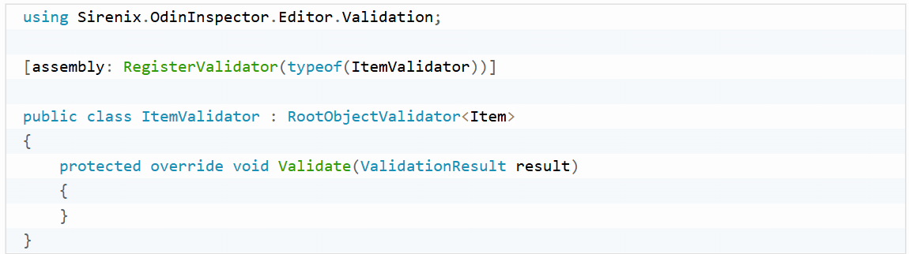

- 上面的例子，集成的是RootObjectValidator `<T>`，T为Item，即以item作为类型参数传递
- 创建一个ScriptableObject ，item 来用于验证，并在Validate中的result中加入部分的验证内容

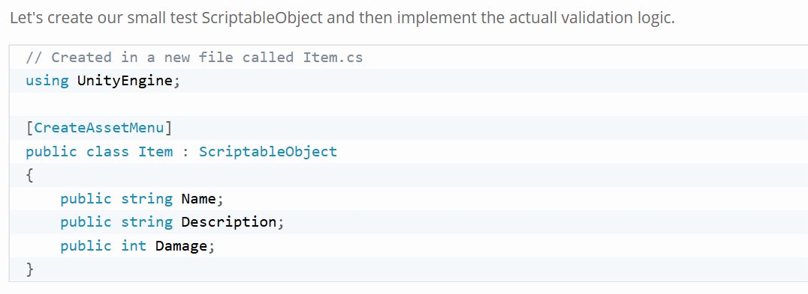

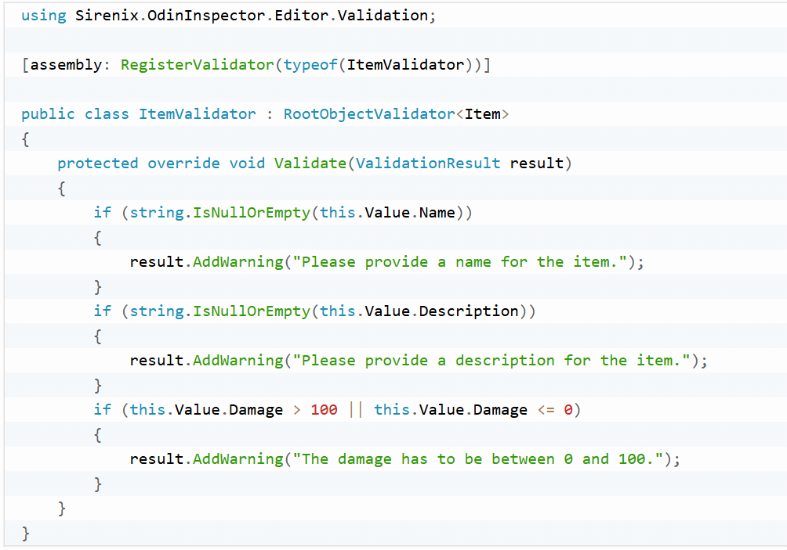

- 检查了ScriptableObject的所有至，并保持其合理的值
- 通过this.values来获取对应的值
- result**.**AddWarning**(**"The damage has to be between 0 and 100."**)**;  ，通过这种方式来增加警告或者其他的内容
- 有以下方法可以添加并解决一些内容，比如添加Fix等

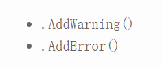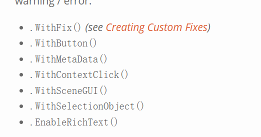

- 如果您想根据警告/错误结果在场景中绘制某些内容，可以使用 .WithSceneGUI() 方法来实现。
  所有这些方法调用都可以串联起来，因为它们使用的是构建器模式。

## AttributeValidator

## SceneValidator

## ISelfValidator

# Validators vs Validation Rules

- 总体就是是否在监视窗口中可以看到对应rule，然后启用和禁用

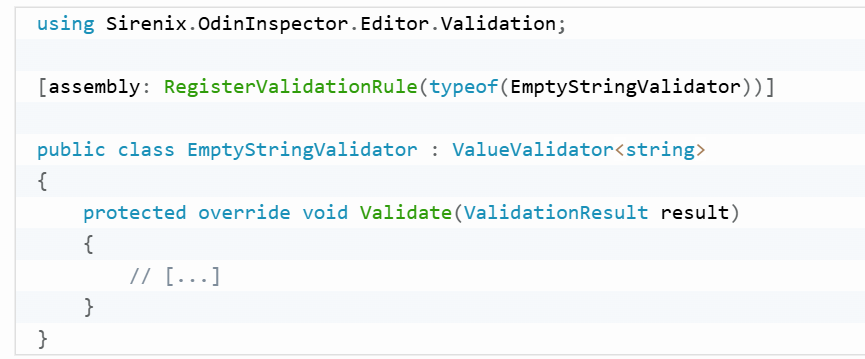

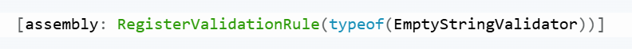

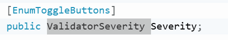

- 通过这样的方式来增加一个**ValidatorSeverity，允许严重程度来更改结果类型**

**窗口显示**

- 可以通过窗口来显示所有的rule，enable（左边的小框），然后点击对应的严重程度

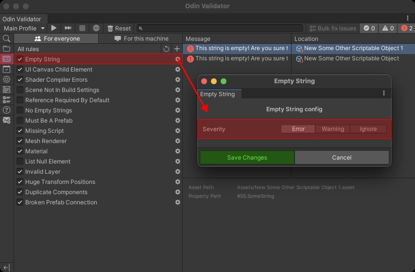

# Creating Custom Fixes

- 通过在AddWarning后加上WithFix 来解决部分Issue问题

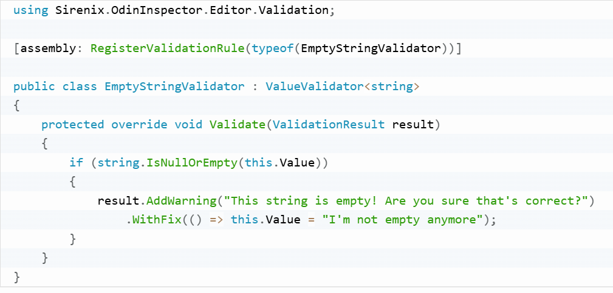

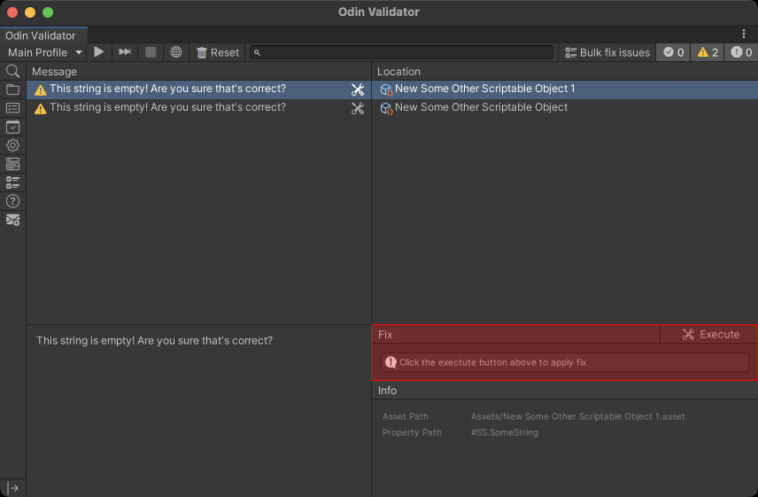

- 为其添加参数，在Fix时
- FixArgs， 将value加入，填写对应的value
- 该类必须是具有公共无参数构造函数的非抽象类型。

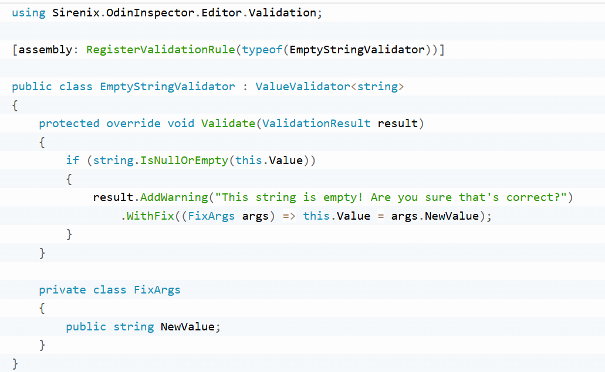

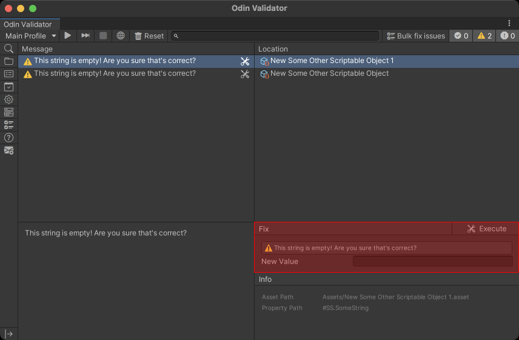
