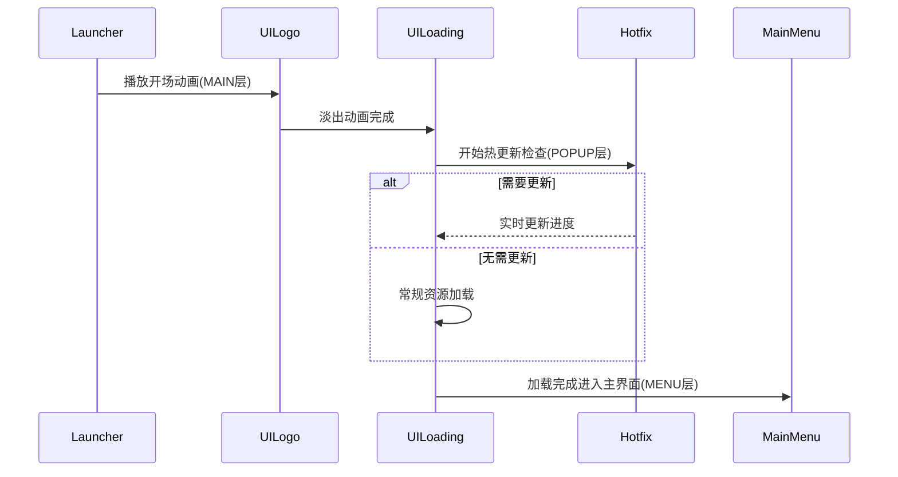

# UTool

 用于存储部分unity的工具

## 目录

- 用于生成icon [用于生成icon的工具](./IconGenerate/iconGenerate.md)

```mermaid
sequenceDiagram
    participant Launcher
    participant UILogo
    participant UILoading
    participant Hotfix
    participant MainMenu

    Launcher->>UILogo: 播放开场动画(MAIN层)
    UILogo->>UILoading: 淡出动画完成
    UILoading->>Hotfix: 开始热更新检查(POPUP层)
    alt 需要更新
        Hotfix-->>UILoading: 实时更新进度
    else 无需更新
        UILoading->>UILoading: 常规资源加载
    end
    UILoading->>MainMenu: 加载完成进入主界面(MENU层)
```
